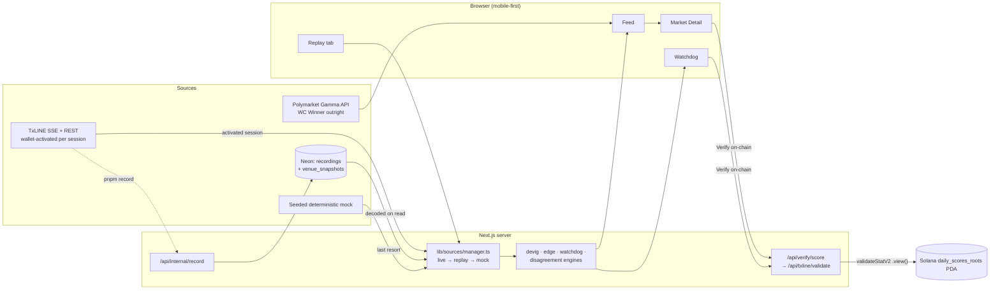

# Linesman

**Linesman scores every Polymarket/Kalshi World Cup price against TxLINE's
de-vigged sharp consensus, anchors that comparison on Solana, and audits
whether venues settled their markets correctly** — a mobile-first "signal,
not catalogue" feed built for the TxODDS × Solana World Cup Hackathon. Open
it cold and it's already alive: no live match required, no setup screen,
just the Feed doing its job (see Showcase mode below).

- **Live** → `/feed` (redirects from `/`)
- **Trust model** → [`docs/ONCHAIN.md`](docs/ONCHAIN.md)
- **Every endpoint the app calls** → [`docs/ENDPOINTS.md`](docs/ENDPOINTS.md)
- **Integration papercuts hit along the way** → [`docs/FRICTION.md`](docs/FRICTION.md)
- **Liveness probe for judges** → `GET /health`

## Why TxLINE is irreplaceable here

Polymarket and Kalshi prices are *crowd* prices — liquidity-weighted opinion,
nothing more. Without an independent, provably-computed "what should this
actually be worth" line, "the crowd disagrees with itself" is the only claim
you can make. TxLINE is the other half of that sentence: a de-vigged,
Merkle-anchored, timestamped fair-value line that exists *outside* any venue's
own order book, so a gap between it and a venue price is evidence of a real
mispricing rather than two crowds disagreeing with each other. Every card in
the Feed, every audit row in the Watchdog, and every "Verify on-chain" press
is downstream of that one property — take TxLINE away and Linesman is just a
prices page.

## Architecture



`lib/sources/manager.ts` is the one seam every screen consumes: a live,
wallet-activated TxLINE session outranks a recorded replay, which outranks
the seeded mock. Nothing fakes liveness — the Feed's freshness chip always
names its real source (`LIVE`, `REPLAY`, or `DEMO DATA`), and `/api/status` /
`/health` expose the same truth machine-readably.

## Run it

```bash
corepack enable
pnpm install
cp .env.example .env.local        # fill in DATABASE_URL + CREDENTIAL_ENCRYPTION_KEY_BASE64
openssl rand -base64 32           # → CREDENTIAL_ENCRYPTION_KEY_BASE64
pnpm db:migrate
pnpm dev
```

The app boots and serves a full Feed/Watchdog/Replay experience with **zero**
TxLINE credentials present — that's the whole point of the mock/showcase
fallback. Wire a real wallet through `/starter`'s existing activation flow
(see below) to light up the live branch.

```bash
pnpm lint
pnpm typecheck
pnpm test
pnpm exec playwright install chromium && pnpm test:e2e
pnpm build
```

## Env vars

See [`.env.example`](.env.example) for the full, commented list. Summary:

| Var | Required | Purpose |
|---|---|---|
| `DATABASE_URL` | yes | Neon Postgres — sessions, credentials, recordings. |
| `CREDENTIAL_ENCRYPTION_KEY_BASE64` | yes | Encrypts TxLINE JWT/API tokens at rest. |
| `SESSION_COOKIE_NAME` | no | Defaults to `txline_session`. |
| `NEXT_PUBLIC_APP_URL` | no | Absolute origin for callback URLs. |
| `NEXT_PUBLIC_{DEVNET,MAINNET}_RPC_URL` | no | Solana RPC endpoints. |
| `SHOWCASE_RECORDING_ID` / `SHOWCASE_SPEED` | no | Which recording + speed the cold-start showcase plays. |
| `RECORDER_SECRET` / `RECORDER_USER_ID` / `RECORDER_NETWORK` | only for `pnpm record` | Headless recorder auth + which credential to tap. |
| `TXLINE_JWT` / `TXLINE_API_TOKEN` / `NETWORK` | only for `pnpm verify` | Headless on-chain proof CLI. |

## Product tour

- **Feed** (`/feed`) — ranked mispricings (|EV| ≥ 3%, liquidity ≥ $500,
  confidence ≥ medium), a Disagreement Index dial, honest source chip.
- **Market Detail** (`/market/[id]`) — price-vs-fair bullet chart, 2h gap
  sparkline, de-vig walkthrough, Verify-on-chain + Trade sticky action bar.
- **Watchdog** (`/watchdog`) — did the venue settle the same way TxLINE
  proved? Tap any row to expand and run the on-chain check.
- **Replay** (`/replay`) — scrub/speed controls over a recorded packet
  trail; the same engine that drives cold-start Showcase mode.

## TxLINE integration reference (inherited boilerplate)

The wallet-authenticated TxLINE plumbing this app is built on is a neutral
starter for wallet-authenticated TxLINE access, live World Cup data,
historical replay, and read-only Solana proof validation — reachable at
`/starter`. It is integration infrastructure, not a wagering product.

### Networks

| Network | Program | TxLINE host | Free service levels |
| --- | --- | --- | --- |
| devnet | `6pW64gN1s2uqjHkn1unFeEjAwJkPGHoppGvS715wyP2J` | `https://txline-dev.txodds.com` | `1` |
| mainnet | `9ExbZjAapQww1vfcisDmrngPinHTEfpjYRWMunJgcKaA` | `https://txline.txodds.com` | `1`, `12` |

Level 1 is the delayed 60-second feed. Mainnet level 12 is real-time. Every
subscription lasts exactly four weeks. RPC, API host, program, mint,
supported levels, IDL, and encrypted credential are selected as one
network-scoped unit.

### Activation flow

The browser owns wallet prompts and sends the subscription transaction.
Route handlers own HTTP-only sessions, encrypted credentials, API proxying,
JWT renewal, and short-lived SSE proxy responses. PostgreSQL stores no
stream events.

1. `POST /auth/guest/start` on the selected TxLINE host.
2. Submit `subscribe(serviceLevelId, 4)` to the selected network program.
3. Sign the exact UTF-8 preimage `${txSig}::${jwt}` (the middle leagues field is empty).
4. Send the base64 wallet signature and `leagues: []` to `/api/token/activate`.
5. Encrypt the returned API token server-side. It is never returned to browser JavaScript. The guest JWT is exposed only in step 3's one-time preimage.

Once activated, `lib/sources/manager.ts` picks it up automatically — no
redeploy, no reload; the Feed's next poll (≤15s) reports `LIVE`.

### Manual devnet checklist

These steps require real external accounts and are not covered by mocked
automation:

1. Create a Neon database, apply `pnpm db:migrate`, and start the app with server-only secrets configured.
2. Fund a compatible wallet with devnet SOL and connect it on devnet.
3. Sign in, create the guest credential, and submit service-level-1 for four weeks.
4. Inspect and sign `${txSig}::${jwt}`, activate, reload, and confirm the setup resumes as ready.
5. Fetch fixtures plus odds and score snapshots.
6. Open both streams; confirm a quiet stream becomes `idle`, not failed.
7. Replay an eligible completed fixture.
8. Choose a score record with a genuine sequence and validate at least one stat through the read-only `validateStatV2` view (or press "Verify on-chain" anywhere in Linesman).
9. Check application and platform logs contain no JWT, API token, authorization header, login signature, or activation signature.

For Vercel, create a project, attach all `.env.example` variables with the
production URL, attach a production Neon branch, run migrations against that
branch, deploy, then repeat steps 2–9 on the deployed URL.

### Troubleshooting

- `401`: the guest JWT renewal failed or the renewed JWT was rejected.
- `403`: verify wallet ownership, subscription state, service level, and selected network.
- Insufficient SOL: fund the active cluster; devnet and mainnet balances are unrelated.
- Missing `signMessage`: switch to a compatible wallet.
- Quiet stream: wait for events; idle is expected when no match update is published.
- Malformed proof: a hash was not exactly 32 bytes.
- Root mismatch: confirm the proof timestamp, selected network, and derived epoch-day account.
- Incomplete stat coverage: request only stat keys returned by the proof endpoint.

More live/API findings are logged in [`docs/FRICTION.md`](docs/FRICTION.md) rather than duplicated here.
